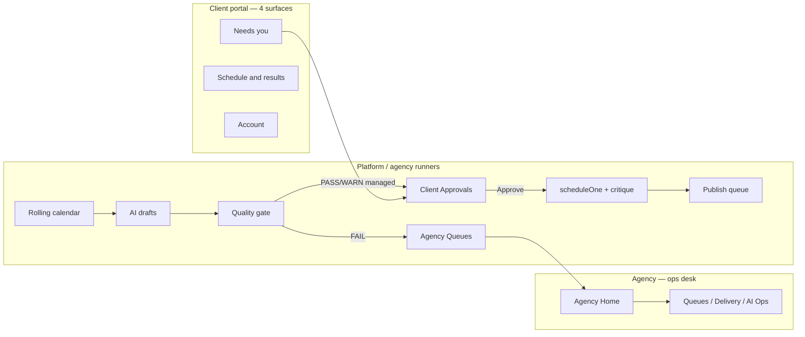

# Automation-First Plan

> Concrete product + engineering plan to make Marketing Command Centre feel like **managed marketing automation**, not a DIY console.  
> Synthesized 2026-07-11 from parallel audits (client portal · agency IA · automation engines · model vs UX).  
> Hard locks unchanged: critique · OAuth-only · no auto-spend · isolation · `appEnv()` · AI never unsupervised-publishes.

---

## Product contract

**Client buys:** operated marketing (strategy, calendar, content, campaigns) under a service level and budget — not a social studio.

**System does weekly:** top up rolling calendar → draft governed content → quality-route → schedule already-approved work when authority allows → publish via critique-gated queue → surface exceptions on the agency desk.

**Client does monthly:** approve what’s waiting · glance schedule/results · pay/top-up · answer only when we ask. No seasons, Studio, Brand Brain, or campaign packaging.

---

## Target experience

---

## Wave A — Client portal = review only (UX cut)

**Ideal nav (4):** Needs you · Approvals · Schedule & results · Account

| Change | Detail |
|--------|--------|
| **Remove from Home** | Inline `ClientPromoPicker` — Home is status + “needs you” only |
| **Promos** | Agency proposes cards; client one-tap Interest/Approve. Dates/price/channels **agency-owned** (or pre-filled) |
| **Calendar** | Glance-only. Stop live `rescheduleOne` / cancel from portal — convert to Ask ticket (or agency-only) |
| **Ask us** | Plain-language message + optional files. Demote 11-type brief / offer / CTA / consent block to agency follow-up |
| **Profile** | Strategy fields (voice, CTAs, audience, social graph) **agency-only**; client keeps contact/hours rare corrections via Ask |
| **Billing** | Keep top-up + invoices; auto top-up → on/off + amount; rest agency |
| **Files** | “Share a photo” under Account/Ask — drop type taxonomy if possible |
| **Nav** | Collapse 10 destinations → 4; mobile: Approvals · Schedule · Results · Account |

**Keep as-is:** `portalApproveContentAction` · `portalRequestChangesAction` · `answerClientGapAction` · results · invoices.

**Primary files:** `client-shell.tsx` · `client/page.tsx` · `ClientPromoPicker` · `calendar/actions.ts` · `requests/new` · `profile/*` · `payments/*`

---

## Wave B — Agency = automation ops desk (IA)

**Top destinations (≤7):** Agency Home · Queues · Clients · Delivery · AI Ops · Results · Settings

| Change | Detail |
|--------|--------|
| **Agency Home** | Exceptions first using existing `buildAgencyOpsBundle` + due/failed publish counts + workload chips + AI queue (wire `aiMos`, not `[]`) |
| **Queues hub** | Approvals + quality holds + client asks + client-review waiting — one human inbox |
| **Delivery in sidebar (admin)** | Calendar + Publishing + Content/Campaigns — stop burying daily delivery behind Clients → More tools |
| **Workspace** | Collapse 12 peer links into one Settings |
| **Company strip** | Keep 6 primaries; relabel More tools → Produce / Brand / Channels / Automate; entitlement-hide empty Grow |
| **Company Overview** | Client ops board (exceptions · next 7 posts · open AI · health); push profile behind Brand |

**Primary files:** `app-shell.tsx` · `dashboard/page.tsx` · `agency-ops*.tsx` · `company-tools-nav.tsx` · `companies/[id]/page.tsx`

---

## Wave C — Close the automation loop (engines)

Without this, UX cuts still feel empty. **Extend existing runners — no second publish path.**

### P0 (makes it feel automated)

| Gap | Fix |
|-----|-----|
| Rolling calendar stops at suggestions | After `maintainRollingCalendarsForTenant`, **auto-accept → draft → `applyQualityRoutingAfterDraft`** when `canAutoExecuteLowRisk(level, "draft_content")` |
| Auto-schedule too narrow | Widen `progressManagedSchedulesForTenant` beyond assist-only rows to approved campaign-builder content with planned dates |
| Delivery stuck at `awaiting_approval` | Promote run → `active` when enough items approved/scheduled |
| Silent homework | Require approval contact + Resend for auto-submit; else hold with agency alert |

### P1

| Gap | Fix |
|-----|-----|
| `managed_exceptions` cannot auto-schedule | Unlock low-risk `schedule_approved` (parked in PENDING) |
| Staff approve orphans content | Mirror auto-schedule under `fully_managed` after staff approve (still via `scheduleOne`) |
| Quality holds have weak SLA | Agency-ops ping for stale `quality_hold` / client review |
| Default level = `approval` | New clients default **`managed_exceptions`** (product decision) — client still Approves; system does the rest |

### P2

Tick caps · standing pre-authorised categories (explicit product decision) · live analytics/ads when W6 GO · visuals LIVE.

**Primary files:** `delivery-runner.ts` · `rolling-calendar.ts` · `calendar-assist.ts` · `quality-routing.ts` · `scheduler.ts` · authority helpers in managed-service

---

## Wave D — Demo proof (no live Google)

Observable with `CC_LOCAL_DEMO` + simulated connectors:

1. Onboard company → within one cron/tick: strategy + calendar assists **become drafts in Approvals** (managed levels).
2. Client session = Approvals → Approve → post appears scheduled/simulated published — **no** Studio/Profile/Promo builder.
3. Agency Home shows exceptions / next publishes / AI queue without opening Grow modules.
4. Critique still blocks bad content; wallet floor still blocks spend.
5. Client calendar = own posts only; agency `?company=` = delivery first.

---

## Sequencing (recommended)

| Order | Wave | Outcome | Status |
|------:|------|---------|--------|
| 1 | **C P0** | Machine actually drafts/schedules — product stops lying | **DONE (uncommitted)** |
| 2 | **A** | Client portal stops teaching DIY | **DONE (uncommitted)** |
| 3 | **B** | Agency stops looking like a module zoo | **DONE (uncommitted)** |
| 4 | **C P1** + default service level | Managed levels feel complete | pending |
| 5 | **D** verify in demo | Proof before any `*_LIVE` | **NEXT** |
| 6 | W6 Google GO | Real outbound — only after A–D hold | waiting |

Do **not** flip `*_LIVE` to “fix” UX. Automation completeness is state-machine + IA first.

---

## Non-goals (this plan)

- Unsupervised AI publish or auto-spend  
- Second publish path outside `scheduleOne` → `publishDuePosts`  
- Building Grow modules (Email/SMS/CRM…) until delivery loop is undeniable  
- Committing `_owner_paste_*` / integrator temps  

---

## Success definition

A restaurant owner with no marketing time opens the portal once a week, taps Approve a few times, checks Results, and never fills a campaign brief. The agency opens Agency Home and only touches exceptions. That is the product.
