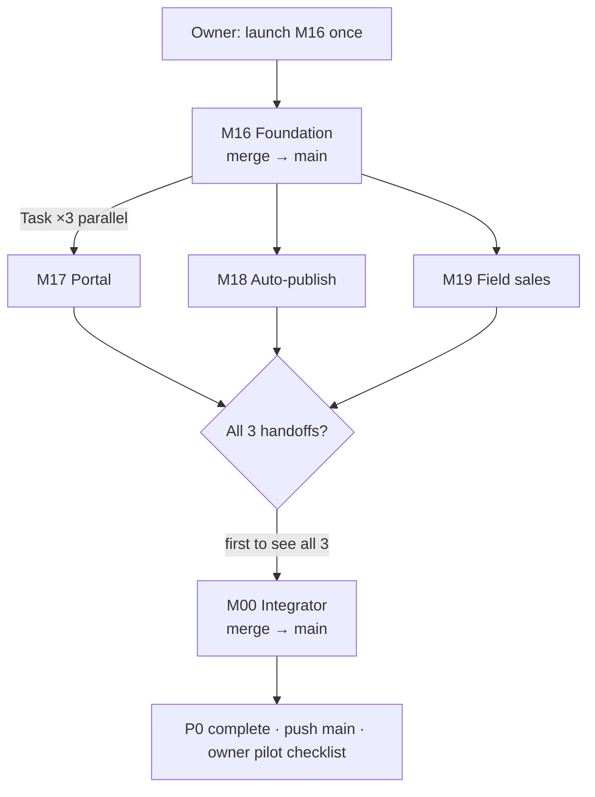

# P0 auto-orchestration — hands-off multi-agent chain

**Owner action required once:** launch **`M16-P0-Foundation`** (single chat).  
**After that:** agents spawn the next group automatically. You can step away.

**Path:** `F:/MarketingHub/command-centre`  
**Ledger:** `docs/parallel/PROGRESS.md` → section **P0 orchestration state**

---

## Pipeline (visual)



---

## Orchestration state (in PROGRESS.md)

Every finishing agent **reads then updates** this table. Use it to dedupe spawns.

| Flag | Meaning | Set by | When |
|------|---------|--------|------|
| `m16_merged` | M16 on `main` | M16 | After merge + push |
| `parallel_launched` | M17+M18+M19 Task calls sent | M16 | Immediately after spawn |
| `m17_handoff` | `M17-handoff.md` committed | M17 | End of work |
| `m18_handoff` | `M18-handoff.md` committed | M18 | End of work |
| `m19_handoff` | `M19-handoff.md` committed | M19 | End of work |
| `m00_launched` | M00 Task call sent | M17 or M18 or M19 | Fan-in barrier passed |
| `p0_complete` | M00 merged + green build | M00 | Final |

**Dedup rule:** Before any `Task` spawn, read flags. If target flag is already `yes`, **do not spawn again**.

---

## How agents spawn the next group (Cursor Task tool)

Use the **`Task`** tool with `subagent_type: generalPurpose` and `run_in_background: true` for parallel builders.

### M16 → spawn M17 + M18 + M19 (one message, three Task calls)

After M16 merges to `main` and pushes:

1. Update `PROGRESS.md`: `m16_merged=yes`
2. If `parallel_launched` is not `yes`:
   - Set `parallel_launched=yes` and commit
   - Launch **three** Task agents **in the same turn** (parallel), each with the prompt from:
     - `docs/parallel/M17-P0-client-portal-prompt.md`
     - `docs/parallel/M18-P0-auto-publish-prompt.md`
     - `docs/parallel/M19-P0-field-sales-prompt.md`
3. Tell owner: *"P0 chain running — M17/M18/M19 started in background. No action needed until M00 completes."*

Each spawned agent must:

```text
git fetch && git checkout main && git pull
git checkout -b p0/m{NN}-...
```

### M17 / M18 / M19 → fan-in spawn M00

On completion (handoff written, branch pushed):

1. Update own handoff flag in `PROGRESS.md` (`m17_handoff=yes`, etc.) and commit to **your branch**
2. Read `PROGRESS.md` on `main` (fetch/pull) — check all three: `m17_handoff`, `m18_handoff`, `m19_handoff` = `yes`
3. If all three `yes` AND `m00_launched` is not `yes`:
   - Pull `main`, set `m00_launched=yes`, commit + push `main` (**claim fan-in**)
   - Re-read; if you were second, `m00_launched` already yes → stop
   - Launch **one** Task: `M00-P0-Integrator` using `docs/parallel/M00-P0-integrator-prompt.md`

**Fan-in claim:** First agent to push `m00_launched=yes` wins; others skip M00 launch.

### M00 → finish chain

1. Merge branches: `p0/m18-auto-publish` → `p0/m17-client-portal` → `p0/m19-field-sales` → `main`  
   (order: **m18 → m17 → m19** — client-approval before portal E2E)
2. Add portal self-tests, verify build + fixtures
3. Update `HANDOVER.md` START HERE, `PROGRESS.md` `p0_complete=yes`
4. `git push origin main` (triggers Vercel deploy)
5. Output **owner pilot checklist** from PROGRESS.md — **stop** (no further spawns)

---

## Sequence checklist (per agent)

### M16 exit sequence

```
□ tsc + build + fixtures 67/67 · 20/20
□ docs/parallel/M16-handoff.md
□ commit on p0/m16-foundation
□ merge to main + push main
□ PROGRESS: m16_merged=yes
□ if parallel_launched≠yes → parallel_launched=yes + Task(M17)+Task(M18)+Task(M19)
□ message owner: chain autonomous from here
```

### M17 / M18 / M19 exit sequence

```
□ handoff md on branch
□ commit + push branch
□ PROGRESS on branch: m{N}handoff=yes (or update main after fan-in read)
□ pull main → all m17/m18/m19 handoffs yes?
□ if yes and m00_launched≠yes → claim m00_launched + Task(M00)
```

### M00 exit sequence

```
□ merge all p0 branches to main
□ selftest portal + fixtures target
□ HANDOVER + PROGRESS p0_complete=yes
□ push main
□ owner pilot checklist in final message
```

---

## Owner step-away card

| Step | You | Time |
|------|-----|------|
| 1 | Open **one** chat: `M16-P0-Foundation` · paste `docs/parallel/M16-P0-foundation-prompt.md` | 2 min |
| 2 | Step away | — |
| 3 | Return when any agent says **"P0 complete"** or check `PROGRESS.md` `p0_complete=yes` | ~3–5 days |
| 4 | Run pilot checklist on `https://mangotickle.com.au` | 30 min |

**Do not:** launch M17/M18/M19 manually · paste migration 0028 · flip live flags.

**Optional:** Watch `git log main` or Vercel deploys for progress.

---

## Failure handling (agents)

| Failure | Action |
|---------|--------|
| M16 build red | Fix on branch; do **not** spawn parallel until green |
| One parallel agent fails | Others continue; failed agent retries; M00 waits for all handoffs |
| M00 merge conflict | M00 resolves; focus files: `rbac.ts`, redirects |
| Double M00 spawn | Harmless if second checks `m00_launched` before Task |

---

## Related

- `docs/parallel/P0-MULTI-AGENT-PLAN.md` — scope + file ownership
- `docs/parallel/M{16,17,18,19,00}-P0-*-prompt.md` — per-agent prompts
- `docs/P0-IMPLEMENTATION-PLAN.md` — what P0 delivers
